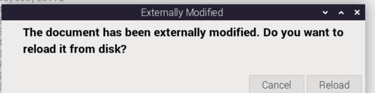

# Raspberry Pi 5 and Pico 2W Standalone Environmental Data Measurement System

## Project Overview
This project implements a standalone environmental data measurement system using a Raspberry Pi 5 (P1) as the central hub and two Raspberry Pi Pico 2W devices (P2, P3) as sensor nodes. The system collects environmental data such as temperature, humidity, atmospheric pressure, gas parameters, and CO2 concentration, then visualizes and stores this data for analysis.

## System Components
1. **Raspberry Pi 5 (P1)** - Central hub that:
   - Acts as a WiFi access point for P2 and P3
   - Collects and stores environmental data from sensor nodes
   - Provides web interface for data visualization
   - Monitors connection quality with sensor nodes

2. **Raspberry Pi Pico 2W (P2, P3)** - Sensor nodes that:
   - Collect environmental data using BME680 sensors
   - Measure CO2 levels using MH-Z19B sensors
   - Transmit data to P1 via WiFi
   - Auto-restart on errors or connection issues

3. **Sensors**:
   - BME680 - Measures temperature, humidity, atmospheric pressure, and gas parameters
   - MH-Z19B - Measures CO2 concentration

## Project Structure
The project is organized within the RaspPi5_APconnection directory and includes:
ただし必要に応じてこれらの構造は修正、増設される。

```
(base design and structure.)
RaspPi5_APconnection\
├── p1_software\              # Software for Raspberry Pi 5
│   ├── ap_setup\             # Access point configuration
│   ├── data_collection\      # Data collection from P2 and P3
│   ├── web_interface\        # Web UI for data visualization
│   └── connection_monitor\   # WiFi signal monitoring
├── p2_p3_software\           # Software for Pico 2W devices
│   ├── sensor_drivers\       # BME680 and MH-Z19B drivers
│   ├── data_transmission\    # WiFi communication with P1
│   └── error_handling\       # Auto-restart functionality
└── documentation\            # User manuals and guides
    ├── installation\         # Installation instructions
    ├── operation\            # Operation instructions
    └── troubleshooting\      # Troubleshooting guides
```

## Key Features

### P1 (Raspberry Pi 5) Features
- **Dual WiFi Functionality**:
  - Acts as WiFi access point (AP) for P2 and P3
  - Can connect to internet via USB WiFi dongle
  - Configurable to prioritize AP mode when USB dongle is absent
  - # P1の仕様
* P2,P3とWifi接続するためのWifiをアクセスポイント化する機能を有する。この機能は任意でAPモードと通常Wifiモードを切り替えることができる（取扱説明あり）
* ただし、USB Wifiドングルを接続し、通常のインターネットにもWifi接続できる。（ドングル使う場合の取扱説明あり）
* つまり、アクセスポイントとしてのWifi経路とWeb接続のためのWifi経路の2系統をもつ。
* USB Wifiドングルがない場合はAP機能を優先する。APとしてのアクセスポイントのIPアドレス関連は下記のようにする。
dnsmasq_config = f"""# dnsmasq configuration for Raspberry Pi 5 AP
interface=wlan0
dhcp-range=192.168.50.50,192.168.50.150,255.255.255.0,24h
domain=wlan
address=/gw.wlan/192.168.50.1
bogus-priv
server=8.8.8.8
server=8.8.4.4
とする。設定できない場合は設定可能なアドレスとする。
* 
* P2、P3から送られた環境データを受信し、CSVdataとして蓄積する。dataは年月日と時刻、気温、湿度、大気圧、ガスパラメータ。そしてCO2濃度である。
* あくせう
* P1は蓄積したデータをWifi接続したスマートフォンから任意のIPアドレスにアクセスすることで閲覧可能なWebUIを備える
* WebUIは蓄積した環境データを時系列にグラフ化する機能。最新の環境データを数値で表示する機能、グラフのデータをCSVの形でエクスポートし、ダウンロードできる機能を備える。
* webUIとは別にP1にVNC等でアクセスした際にグラフを閲覧する確認用プログラムも作成する（取扱説明あり）
* 接続しているP2,P3とのWifiの信号強度、Ping、noiseの情報も５秒(または任意設定)ごとにリアルタイムに測定して表示できる機能を有する。
* 信号強度はAP化したP1とP2,P3の設置距離や場所を判断するために使う。WebUIとVNC接続時用の個別APPの二系統を作る。(取扱説明あり)


- **Data Management**:
  - Receives and stores environmental data from P2 and P3
  - Stores data in CSV format with timestamp, temperature, humidity, pressure, gas parameters, and CO2 levels

- **Visualization**:
  - Web UI accessible from smartphones/devices connected to P1's WiFi
  - Time-series graphs of environmental data
  - Real-time display of current readings
  - CSV export functionality for downloaded data

- **Connection Monitoring**:
  - Measures WiFi signal strength, ping times, and noise levels with P2 and P3
  - Updates every 5 seconds (configurable)
  - Helps optimize physical placement of devices
  - Available through both Web UI and VNC interface

### P2, P3 (Raspberry Pi Pico 2W) Features
- **Sensor Integration**:
  - BME680 sensor readings every 30 seconds
  - MH-Z19B CO2 readings every 30 seconds

- **Data Transmission**:
  - Continuous data transmission to P1 via WiFi
  - Unique identification for P2 and P3 devices

- **Reliability**:
  - Automatic restart on sensor errors or data collection failures
  - Automatic WiFi reconnection after restart

## Installation and Setup
Detailed installation guides are provided for:
- Setting up P1 (Raspberry Pi 5) as an access point
- Installing and configuring sensor software on P2 and P3
- Connecting the system components
- Initial system testing and validation

## Version Information
All software components and documentation include version numbers for proper tracking and compatibility management.

## Target Audience
This project is designed with beginners in mind, with comprehensive documentation that explains not only how to use the system but also the underlying concepts and structure.

## Additional action_Ver.2.0
- センサーBME680単独バージョンもfilename_soloというプログラム集で作成してください。
- 従来のプログラム集を参考にSoloVerはintallation_solo,p1_software_solo,P2P3_software_soloという単独ディレクトリを作りそこに保存すること。
- 前回の作成途中でエラーが出たためそれを回避してすでにあるディレクトリの情報も解析すること。
- 本指令ではまずは対応したP1向けのプログラムを作ってください。
- またP1は再起動した際にアクセスポイントの起動、データ収集サービスの起動、Webインターフェイスの起動、接続モニターの起動など複数の作業が必要になるため、一回の実行ですべて立ち上げられる実行ファイルとその解析を日本語で作成してください。
- 必要に応じてDocumentationもSolo用に新調してください。
- 
## Additional action_Ver.2.1
- P1向けのadditionalaction_Ver2.0に基づき対応したP2,P3用のモデルを作成してください。
- RaspPi5_APconnectionで用いるP1のIP設定は
- ap_ip=192.168.0.1
ap_netmask=255.255.255.0
ap_dhcp_range_start=192.168.0.50
ap_dhcp_range_end=192.168.0.150
とするためすべての関連プログラムの既存設定をこれに準じた形に修正してください。

## Additional action_Ver.2.2
P1においてpipを使ってRaspberryPiに直接Pythonモジュールをinstallすることは環境が破壊される可能性があるためすべての動作は下記の
仮想環境化で実施する。 そのためinstall時及び実際に各機能を実行する際、及び自動起動する際には下記の仮想環境を実行する旨修正、またはマニュアルに追記すること。

- Set up virtual environment
cd ~
python3 -m venv envmonitor-venv
source envmonitor-venv/bin/activate

- Install required Python packages
pip install flask flask-socketio pandas plotly

またVer2以降の修正で追加で必要なinstall項目があればそれも追記すること

## Additional action_Ver.2.3 
Additional action_Ver.2.2に対応したラズパイPico2Wのパッケージを作成する。
データ送信、エラーハンドリング、センサードライバは通常通りだが、Solo対応のP1に適合した形のプログラムとして修正する。
作業と成果物はG:\RPi-Development\RaspPi5_APconnection\P2_software_soloに保管する。

## Additional action_Ver.2.5
- G:\RPi-Development\RaspPi5_APconnection\Pico2BME680singletest\BME680forP2_real.pyにあるBME680設定情報をP2software_soloに反映してエラーを解消する主な変更点は下記


- 0 、センサーのアドレスの修正
sensor = BME680Sensor(address=0x77)


- 1 、ガス測定用のヒーターを有効にする設定
ctrl_gas = self._read_byte(BME680_CTRL_GAS_ADDR)
ctrl_gas |= 0x10  # heater enable bit を立てる
self._write_byte(BME680_CTRL_GAS_ADDR, ctrl_gas)


- ２、ヒーターの温度制御の改良
heatr_res = int(3.4 + ((temp - 20) * 0.6 / 100) * 1000)
heatr_res = min(max(0, heatr_res), 255)  # ★ 追加：0〜255に制限
self._write_byte(0x5A, heatr_res)


- 3、amb_temp未定義の対処
仮の周囲温度（ambient temperature）を仕様
amb_temp = 25  # 通常室温のデフォルト値
var5 = var4 + (var3 * amb_temp)

その他変更点があれば反映する。

以上を踏まえた修正を実施し、G:\RPi-Development\RaspPi5_APconnection\P2_software_solo2に保管する。

## Additional action_Ver.3.0
G:\RPi-Development\RaspPi5_APconnection\Pico2BME680singletest\OK2bme680Pico
に保存されたbme680.pyを参照したbme680_main.pyでP2のセンサーが確実に駆動できることを確認したため、このモジュールを基幹とした
P2_software_solo3を作成する。(G:\RPi-Development\RaspPi5_APconnection\P2_software_solo3)
センサドライバは上記bme680モジュールを用い、出力情報をdata_transmissionのmoduleで送信する構造とする。


## Additional action_Ver.3.1
G:\RPi-Development\RaspPi5_APconnection\Ver3.1を参照し
全体のP1とP2の整合性やコネクション周りのエラーをすべて検出して修正してください。
修正後のマニュアルも同一ディレクトリ内に日本語表記で作成すること。
P1の一括起動プログラムstart_p1_solo.pyは便利だが起動している案件が正常であることをきちんとコマンドプロンプト上に表記するような機能を追加すること。
またP2はラズパイPico2W想定だがネットワーク接続にエラーが頻発するため起動時に５秒以上のディレイを入れてセンサ、Wifi送信など各機能を立ち上げられるようにすること。
LEDの点灯機能は データ送信時、Wifiエラー、センサエラー、両方エラーなど識別できるようプログラム間の整理を行うすること。
Please refer to G:\RPi-Development\RaspPi5_APconnection\Ver3.1 and perform the following:
Check and correct all inconsistencies and connection-related errors between P1 and P2 throughout the entire system.
After making corrections, create a new Japanese-language manual and place it in the same directory.
While start_p1_solo.py (the unified startup script for P1) is convenient, please enhance its functionality to clearly indicate on the command prompt whether each running process is operating correctly.
P2 is intended to run on a Raspberry Pi Pico W, but network connection errors occur frequently. Therefore, add a delay of more than 5 seconds at startup to ensure that the sensor, Wi-Fi transmission, and other functions are initialized properly.
For the LED indicator function, reorganize the program logic so that it can distinguish between different statuses such as:
Data transmission,Wi-Fi error
Sensor error,Combined errors (both Wi-Fi and sensor)
Please implement the above.

すべての作業は上記ディレクトリ内で実施する
All tasks must be carried out within the above directory.

## Additional action_Ver.3.2
あなた:
wifi_client_solo.py に送信リトライ機能	現状は送信1回失敗で終了だが
最大5回まで自動再送してもよいように修正した完全版のプログラムを提供してください。

またP2_watchdog_solo.py	reset_device()が machine.reset() で即時再起動	
エラー時ログを確実に出力・保存できているか
要確認、すなわちFlash書き込みタイミングと競合するriskに対して対策した修正を行う。
また上記変更によって必要な修正をVer3.1のプログラム全体を俯瞰して実行する。
完成品はすべてVer3.2のフォルダに保管する。必要な未修正ファイルも併せて設置する。

## Additional action_Ver.3.5
- Ver3.1とVer3.2のシステムをベースに新た二酸化炭素センサーをP2に増設する。
- センサはMH-Z19Cでピンアサインは下記
VCC（赤）	VBUS（5V、ピン40）
GND（黒）	GND（ピン38）
TX（緑）	GP9（ピン12）
RX（青）	GP8（ピン11）
- CO2取得のために起動直後は３０秒の保持を行い。その後測定を実施する。
測定値はBME680dataとともにP1に送信される。
P1ではdataを記録しつつWebアプリ上で可視化できるようにする。

・P1のウェブアプリの注意点
- 修正前の時点で気温、湿度、気圧、Gas抵抗がグラフ化されるがすべての縦軸が0から100という意味不明な値になっているため
このレンジを任意で変更できるように修正すること、またCO2グラフも追加すること。
- また常にLoadingGraphという読み込みサインが表示されたままになるため修正すること。
- またWebアプリ上で接続しているP2の信号強度などの情報を随時表示するように改良すること。
- すべての情報は下記に保管し、そのままコピーすることでP1,P2に即時使えるように改良する
G:\RPi-Development\RaspPi5_APconnection\Ver3.5
アップデートしたinstallマニュアルと操作説明書を日本語で追加すること。これもVer3.5フォルダ内に設置する。

## Additional action_Ver.3.51
P2_software_soloの修正。
作業成果物はすべてP2_35_1ディレクトリに保存すること。

G:\RPi-Development\RaspPi5_APconnection\Ver3.5\P2_35_1

P2_software_solo35をThonny上で実行すると下記のエラーが生じる。

MPY: soft reboot

=== Raspberry Pi Pico 2W Environmental Monitor Ver3.5 ===
Initializing...
Initializing I2C for BME680...
I2C devices found: ['0x77']
Initializing BME680 sensor...
Initializing MH-Z19C CO2 sensor...
MH-Z19C initialized on UART1 (TX: GP8, RX: GP9)
Warming up for 30 seconds...
Initializing WiFi client...
Initializing data transmitter...
Initializing watchdog...
Watchdog initialized with 8000ms timeout
Initialization complete!
Connecting to WiFi...
Connecting to WiFi network: RaspberryPi5_AP_Solo
You may need to press "Stop/Restart" or hard-reset your MicroPython device and try again.

PROBLEM IN THONNY'S BACK-END: Exception while handling 'Run' (ConnectionError: EOF).
See Thonny's backend.log for more info.

Process ended with exit code 1.
────────────────────────────────────────────────────────────────────────────────────────────────────────────────────────────────────────────────────────────────────────────────────────────────────────

Unable to connect to COM3: port not found

Process ended with exit code 1.

想定原因は下記だがこれ以外にも発生理由があるため柔軟に対応すること。
①	Wi-Fi接続失敗によるmachine.reset()	main.py の client.connect() が失敗したら、5秒待って machine.reset() を呼んでいます
②	Thonny上でのUSB切断と再接続	reset()によりUSBシリアルポートが物理的に一時切断 → Thonnyが通信不能になり「EOF」例外発生
🟠 原因2：client.connect() に十分な時間を与えていなかった
main.py では最大10秒しか待機しない設定になっており、タイミングによって接続失敗

🟠 原因3：client.connect() が失敗したあとすぐ machine.reset() を実行していた
これらに対する対策を行う。

## Additional action_Ver.4.0
- Ver3.51までの更新を踏まえてPico2Wの端末を増設する。
- 新しい端末は名前はP3とする。
- 基本的な機能と構成はP2と同等。
- P1での受信システムをP2とP3の二系統から受信できるように改良
- 併せてP1でのWeb閲覧機能を改良し、P2とP3のグラフを重ね書きできるようにする。
- P2,P3から受信したdataはP1中のディレクトリRawData_P2とRawData_P3を構築しここにリアルタイムに上書きし続ける構造に修正
- Webアプリ上のグラフはこのRawDataを読み込みPlotlyとして書き出すシステムとする。
- ウェブ上のグラフはP2、P3を任意のチェックボックスなどで表示設定ON/OFF切り替えできる。
- またP2,P3から得られた湿度と気温から絶対湿度を計算しそれもP2,P3のデータとしてグラフに出力する機能を追加する。絶対湿度の計算はP1上で行う。
- すべての作業はG:\RPi-Development\RaspPi5_APconnection\Ver4.0に保存する。
- main.pyなど不足分を修正
- インストールマニュアル、および使用方法を日本語で記載したものを追加。

## Additional action_Ver.4.1
- 増設したP3のコネクションタイムアウト問題に対して対策をする。
- 成果物は下記リンクに追加する。
- G:\RPi-Development\RaspPi5_APconnection\Ver4.1
- とくにP3のプログラム整合性、ファイル名称、P1との連携、P2とのID衝突が起こらないように調査分析改善してほしい。

特にThonny上で試運転をする場合P2では見られない

想定原因①：接続処理の途中でPico 2Wが自動リセットまたはハング
machine.reset()が呼ばれていなくても、ウォッチドッグタイマ（WDT）や例外によりリセットされる可能性あり。

main.pyでのエラー処理中の再起動箇所は以下で確認されていますmain：

safe_reset(reason="WiFi connection failure")
原因②：WiFi AP（RaspberryPi5）が見つからない、または応答しない
AP名RaspberryPi5_AP_Soloに接続を試みていますが、失敗して5回リトライ後、Picoは再起動しますmain。

その直後、ThonnyがCOMポートを失う（Unable to connect to COM3）＝Picoが自動リセットされた可能性大。

原因③：ThonnyのREPLセッションがWiFi接続途中に切断
ThonnyはUSBシリアルで接続しているため、USB接続が一時的に切れるとREPLセッションが落ちる。

🛠 対策（推奨順）
✅ ①【暫定対策】リセット処理を一時的に無効化
main.pyの以下の行：

safe_reset(reason="WiFi connection failure")
を

# safe_reset(reason="WiFi connection failure")
のようにコメントアウトし、手動で確認できるようにします。

✅ ② WiFiの接続処理に「例外ログだけ記録してリセットしない」設定を試す
例外発生時のhandle_error(...)のあとにsleepだけしてループを継続するように変更する。

# 元のコード
handle_error(Exception("WiFi connection failed"), {"phase": "wifi_connection"})
safe_reset(reason="WiFi connection failure")

# 修正案（Thonnyで開発しやすくする）
handle_error(Exception("WiFi connection failed"), {"phase": "wifi_connection"})
print("開発中のため自動リセットを停止中。手動で再起動してください。")
while True:
    time.sleep(1)
✅ ③ WiFi接続チェック関数にstatus()のログを追加
connect_wifi()内に以下を追加：

print("wlan.status() =", client.wlan.status())
※WiFiの失敗原因を特定しやすくなります。

- 変更履歴や操作方法の日本語マニュアルはVer4.1フォルダ内に作成すること。

## Additional action_Ver.4.15 Debag
成果物は下記に保管する
G:\RPi-Development\RaspPi5_APconnection\Ver4.1\Ver4.15Debag

- P3においてWifi接続確認、センサー接続確認、を検出しエラーがどこで発生しているか確認するためのプログラムを作成する。
- 設定値はこれまでのP3と同じだが、より時間経過や接続に向けてどのプロセスが進行中か逐一Thonny上で確認できること。
- Wifiについては、とくにリセットする、しない、タイムアウト時間設定などの複数パターンを実行して課題発生特定しやすく工夫すること。
- 作業マニュアルは日本語で同一ディレクトリ内に保管する。

- 現状のエラーは下記、実行すると ぴこんぽこんというUSB認識を無限に繰り返すループになってしまう。

MPY: soft reboot
Error log file initialized: /error_log_p3_solo.txt
Starting in 10 seconds...
10 seconds until start...
5 seconds until start...
3 seconds until start...
2 seconds until start...
1 seconds until start...

=== Raspberry Pi Pico 2W Environmental Monitor Ver4.1 (P3) ===
Initializing...
Initializing I2C for BME680...
I2C devices found: ['0x77']
Initializing BME680 sensor...
Initializing BME680 on I2C address 0x77
BME680 found with correct chip ID
BME680 calibration read successfully
BME680 initialization complete
Initializing MH-Z19C CO2 sensor...
MH-Z19C initialized on UART1 (TX: GP8, RX: GP9)
Warming up for 30 seconds...
Initializing WiFi client...
WiFi Client initialized for P3
Server: 192.168.0.1:5000
Initializing data transmitter...
Added sensor: bme680
Added sensor: mhz19c
Initializing watchdog...
Watchdog initialized with 8000ms timeout
Initialization complete!
Connecting to WiFi...
SSID: RaspberryPi5_AP_Solo, Device ID: P3
Maximum retries: 5, Connection timeout: 45 seconds
Connection attempt 1/5...
Connecting to WiFi network: RaspberryPi5_AP_Solo
Connection timeout: 45 seconds
Activating WiFi interface...
Sending connection request to RaspberryPi5_AP_Solo...
PROBLEM IN THONNY'S BACK-END: Exception while handling 'Run' (ConnectionError: EOF).
You may need to press "Stop/Restart" or hard-reset your MicroPython device and try again.

See Thonny's backend.log for more info.

Process ended with exit code 1.
────────────────────────────────────────────────────────────────────────────────────────────────────────────────────────────────────────────────────────────────────────────────────────────────────────

Unable to connect to COM3: port not found

Process ended with exit code 1.

## Additional action_Ver.4.16 Debag
下記対応を実施する
 原因：バックグラウンド処理のブロック
JustAnswer の例ですが、次のような原因が挙げられています：

"continuous loop … wireless connection to the board drops" …
"machine.idle() # This allows the board to manage WiFi during the loop" 
github.com
+5
justanswer.com
+5
forums.raspberrypi.com
+5

➡while True: を一切休ませずに回し続けると、Pico の MicroPython システムが Wi‑Fi の維持・USB シリアル応答の処理を行うタイミングがなくなり、結果として Thonny からの応答が途絶えてしまいます。

対策：ループ内に処理のための“隙間”を入れる
無限ループ内には、最低でも以下のどちらかを含めてください。

① time.sleep() を使う
while True:
    # 本来の処理
    ...
    time.sleep(0.05)  # 50ms 程度でもOK
② machine.idle() を使う（より Wi‑Fi処理に優しい）

import machine, time

while True:
    # 本来の処理
    ...
    machine.idle()
    time.sleep(0.01)
これにより、CPU が余裕を持って Wi‑Fi チップや USB REPL の割込処理を実行できるようになります。

効果検証の方法
while True の中に print("loop!") を入れてループの継続を確認しつつ、

上記の time.sleep() や machine.idle() を有効化前後で、

Thonny 上に Starting main loop… のままになるか、進展するか 比較してみてください。

補足 & 他の可能性
ループ内で 大量のセンサ読み取りや UART ロギング、ネット通信 を実行している場合、それだけでも処理負荷になりやすいです。休止フレームは必須です。

同様の現象は Pico W（MicroPython）の実案件でもよく起きるため、ループには必ず “処理休止” を入れる設計が安全です 
reddit.com
+4
justanswer.com
+4
cebess.wordpress.com
+4
。

結論
Starting main loop… のまま待ち状態になる場合の原因は、無限ループでシステム側の処理に割り込みが入れられず、Wi‑Fi や USB の応答がハングしているためです。
time.sleep() や machine.idle() をループ内に挟むことで、MicroPythonの安定動作が期待できます。

お手数ですが、一度お試し＆動作状況を確認してみてください 😊

## Additional action_Ver.4.17 Debag
修正しましたがまだStarting main loop... で停止してしまいます。下記の対策を実施して下さい
Starting main loop… で止まったまま進まない原因として考えられるのは、MicroPython内部のWi‑FiやUSBの割り込み処理がメインループにより完全にブロックされてしまっている点です。

🔍 背景と原因
フォーラムでは、「無限ループだけ実行し続けると、デバイスが 'busy' 状態になって応答しなくなる」という声があります 
github.com
+2
stackoverflow.com
+2
justanswer.com
+2
。

また、Wi‑FiファームウェアのロードやUSB初期化中にメインループが重くなると、特にAppleなどではUSBがハングしてThonnyが切断されるといった報告もあります 。

JustAnswer上の相談者も「ループが動き続けると無線接続が切れる」「loop内にtime.sleepやidleが必要」とアドバイスされているそうです 
reddit.com
+4
justanswer.com
+4
stackoverflow.com
+4
。

✅ 対策：ループ処理の変更
① time.sleep() を挟む
python
コピーする
編集する
import time

print("Starting main loop...")
while True:
    # センサ取得などの処理
    …
    time.sleep(0.05)  # 約50msの待ちを入れる
② machine.idle() を併用（推奨）
python
コピーする
編集する
import machine, time

print("Starting main loop...")
while True:
    # センサ取得などの処理
    …
    machine.idle()
    time.sleep(0.01)  # idle + 小さな待ちで背景処理がしっかり動く
この idle → sleep の併用 により、Wi‑FiとUSBの割り込み処理が安定し、Thonnyの「Starting main loop…」も進行しやすくなります。

🧪 動作確認のステップ
print("loop!") をループに入れて、処理が進んでいるか確認。

machine.idle()を入れて改善するかをチェック。

idle + sleep 組み合わせで安定しない場合は、sleep時間を調整（0.01〜0.1秒）。

🎯 まとめ
原因：ループが背景処理（Wi‑Fi／USB）を妨げ、Thonnyが応答に追いつけなくなる

解決法：「idle＋sleep」で強制的に背景処理を実行させる

## Additional action_Ver.4.18 Debag
作業フォルダは下記
G:\RPi-Development\RaspPi5_APconnection\Ver4.18Debac
``` 
Error initializing WiFi client: unexpected keyword argument 'debug_mode'
```
このエラーが出る主な理由は、**WiFiClientクラスのコンストラクタに という引数が渡されているが、その引数を受け取るようにWiFiClientの`__init__()`メソッドが定義されていない`debug_mode`ためです。
#### **もしどうしてもが必要ならWiFiClientの`__init__`に追加`debug_mode`**
（通常は上記の方法が推奨）
どうしても必要なら、 のクラスで `wifi_client.py`
``` python
def __init__(self, ssid="...", ..., debug_mode=False):
    self.debug_mode = debug_mode
    # その他初期化処理
```
のように追加する。


## Additional action_Ver.4.19 Debag
下記の原因に対して対策したプログラムを作成し日本語による作業マニュアルも併せて作成する。
特に応急処置の部分の項目を詳細に説明する日本語マニュアルとする。
フォルダはVer4.19Debagディレクトリを作成してそこに保存する。


- 状況main.py は起動後、connect_wifi() を実行。
client.connect() にて wlan.connect(...) 呼び出し後に USB接続が強制切断され、Thonnyが COMポートを失う。
これは Thonny の表示が "PROBLEM IN THONNY'S BACK-END: ConnectionError: EOF" や "Unable to connect to COM3: port not found" を示していることからも明確。

 根本原因
 原因1：wlan.connect()中のタイムアウト時の 例外未処理
コード上では以下のブロックで wlan.connect() を使い、接続を待機します：

self.wlan.connect(self.ssid, self.password)
ただし、一定時間で接続が成立しないと、ESP32ベースのWi-Fiモジュールが内部リセットを起こす ことがあり、その際に Pico W の USB-UART インタフェースも巻き添えで再初期化され、COMポートが消滅します（これは known bug として複数報告があります）。

✅ 原因2：Thonny側が USB切断に過敏
Thonny は Pico W において：

USB経由で REPL（シリアル）通信を維持している

その通信が Wi-Fi 接続中の 例外 or ハングにより切断 されると、COMポート消滅と認識し、"EOF" エラー → 実行中断 → ポート消滅 → 再接続ループ になる

✅ 推奨される対策
対策1：Wi-Fi接続はスレッド化 or try/except で安全に包む
WiFiClient.connect() の中で以下のように 例外全体をtryブロックで囲うことで、MicroPython側がリセットしないよう保護します。


try:
    self.wlan.connect(self.ssid, self.password)
except Exception as e:
    self._debug_print(f"Exception during wlan.connect(): {e}", DEBUG_BASIC)
    return False
また、特に self.wlan.scan() の部分は稀にハングを引き起こすため、ここも try/except で安全化すべきです。

対策2：Wi-Fi 接続確認後に print() をしない
Thonny がシリアルに依存している関係で、Wi-Fi接続直後に大量の print() が入ると USB/REPL が落ちやすい という報告もあります。
したがって、以下のような部分をコメントアウトかログ抑制します：


# print("Connected to SSID:", self.ssid)   # コメントアウトか抑制
# print(f"IP address: {ip}")               # 同様
必要に応じてログをファイルに保存する設計に切り替えるのが安全です。

対策3：最初は WiFiClient.run_network_diagnostics() のみを使い接続は試みない
P2で安定しているなら、P3の個体が電源供給の面やWi-Fiモジュールの不安定性を持っている可能性も高いです。

✅ 応急処置として試すべきこと（段階的）
client.run_network_diagnostics() のみに変更して main loop を切る
connect() を呼び出す箇所をコメントアウトし、main loop が正常に動くかを確認
それでも落ちる場合 → wlan.connect() 前後に print() を削除
client.connect() の self.wlan.connect() を try/except で囲み、ThonnyとのCOM通信を守る
上記後も USBが落ちる → machine.freq(125_000_000) などで処理負荷を軽減して再試行
🔚 結論
この問題は「Wi-Fi接続処理中にMicroPythonが内部でUSB通信を阻害 → Thonnyから見てポート消失」という Pico W + Thonny 特有の構造的問題が引き起こしており、プログラム構造とログ出力の見直しで回避可能です。


## Additional action_Ver.4.19 Debag
下記の原因に対して対策したプログラムを作成し日本語による作業マニュアルも併せて作成する。
特に応急処置の部分の項目を詳細に説明する日本語マニュアルとする。
フォルダはVer4.19Debagディレクトリを作成してそこに保存する。
wifi_client_debugにおいて

input("Press 'y' to continue or any other key to exit...")

この行が run_network_diagnostics() や main.py 側で使われていると、Thonny REPLやUSBでは入力待ちになるが、実際には入力できない＝ハングして見える状態になります。

以下のような制御を追加する。

if self.debug_mode and self.debug_level >= DEBUG_BASIC:
    print("\nDiagnostics Summary:")
    print(f"WiFi Active: {self.wlan.active()}")
    print(f"Target Network Found: {results.get('target_network_found', False)}")
    print(f"Signal Strength: {results.get('target_network_strength', 'N/A')} dBm")
    proceed = True  # ← debugオプションで変えられるようにする
    if not proceed:
        print("Connection attempt skipped. Continuing without WiFi connection.")
        return False
その他の修正指示
1, input() の使用を削除／自動判断に切り替え（REPLで入力は不可）
2, wlan.scan() の直前に time.sleep(1) を入れると安定性が上がる可能性あり
3, run_network_diagnostics() は表示のみにし、WiFi接続制御は別の設定フラグで管理

成果物はG:\RPi-Development\RaspPi5_APconnection\Ver4.19Debagに保管する

## Additional action_Ver.4.20 Debag
- 下記の原因に対して対策したプログラムを作成し日本語による作業マニュアルも併せて作成する。
- 特に応急処置の部分の項目を詳細に説明する日本語マニュアルとする。
- フォルダはVer4.20Debagディレクトリを作成してそこに保存する。
- CO2センサもきちんと駆動させてデータを取得するよう修正する。
- BME680のI2Cアドレスミス
→ ドライバーの初期化時に間違ったアドレス（たとえば0x77と0x76の取り違え）があると、
センサ実装有無に関わらず「値は返る」が「デタラメな値」になることがあります。これを両方検証して正確な値を出力できるよう修正
- Ver4.0のP1のデータ収集形式に会うように修正。
- 
## Additional action_Ver.4.25Debag
- 下記の原因に対して対策したプログラムを作成し日本語による作業マニュアルも併せて作成する。
- 特に応急処置の部分の項目を詳細に説明する日本語マニュアルとする。
- P2についてもP3のでバックプログラムをベースに修正する。
- G:\RPi-Development\RaspPi5_APconnection\Ver4.25Debag\P2_software_debugに保管してあるデータはP3のコピーであるため、これをP2に適合するようファイル名、プログラム内のP3参照をP2に変更し、正しくP1へ送信できるように修正する。
- test_simulation.pyを用いた場合すべてのセンサの値は正確な値が出力されるが、main.pyを実行するとマイナス値など意味不明な値がでるためtest_simlation.pyで得られているデータ出力構造をmain.pyおよび関連するプログラムに適応する。この適応はP2,P3両方に実施しVer4.25ディレクトリ内に完全な形で保管する。
- 
## Additional action_Ver.4.25.1Debag
- P2およびP3のbme680センサの値はG:\RPi-Development\OK2bmeに保管されているアルゴリズムを忠実に用いるよう修正。
- 

## Additional action_Ver.4.25.5 Debag
下記フォルダですべての作業を実施すること、現時点で保管されているデータのはVer 4.251である。
G:\RPi-Development\RaspPi5_APconnection\Ver4.25.5Debag
- P1データ収集と描画システム

timestamp列が文字列のままで datetime に変換されていない
→ グラフ描画時、x=df['timestamp'] で plotly に渡すと、時間軸が正しくプロットされない／全く同一になる場合がありえます。
df['timestamp'] = pd.to_datetime(df['timestamp'])
が実施されていないか、無効になっている可能性があるので確認修正実施。

- P2 も P3 も すべて同じグラフになる現象は df_p2 と df_p3 が両方 None もしくはキャッシュされた同一データを返している疑い
create_dashboard_graphs() → create_time_series_graph() → get_historical_data() にて、キャッシュ（self.data_cache）を使っています。

これにより、誤って P2 と P3 のキャッシュが共有されてしまった場合、両方のグラフが同じ形になる可能性があるため調査・対策する。

- 原因候補と内容と対応
🟡 timestampがdatetime型でない	df['timestamp'] = pd.to_datetime(df['timestamp']) を追加または強制変換
🟠 キャッシュが共有または上書きされている	self.data_cacheが誤って共通化されているか、キーの使い方ミスを確認
🔴 読み込み失敗で空DataFrame	parameter in df.columns が False のとき y=[] になり全グラフ同じになる

- Connection Status が一切表示されないため、P2、P3に対する無線強度の情報やnoiseといった情報を収集するようP1,P2,P3の必要部位を修正する。


## Additional action_Ver.4.3 Debag
- Webアプリ上のグラフの原因はほぼ確実に timestamp 列の扱いが datetime 型になっていないことでグラフの情報が正しく認識されていないので修正
アップロードいただいた P1_app_solo.py を確認したところ、create_time_series_graph() の中では get_historical_data() 側で 
timestamp を変換していますが、それがキャッシュされた後に別のグラフで誤って使い回される際に不整合が起きているようです。
get_historical_data() 側のキャッシュは壊れていないが、df.copy() してもその中身が壊れていたら timestamp のまま str 型になる。
そのため、グラフ描画時にも再変換が必要。
- またP1中の
/var/lib/raspap_solo/data/RawData_P2 
/var/lib/raspap_solo/data/RawData_P3
にデータがストレージされているためこのデータを読み込み＋10秒おきに更新し、Webアプリ立ち上げ時点で過去のデータ踏まえたグラフが描画されるように修正しなさい。
- 修正点は日本語のマニュアルに提示すること。
- G:\RPi-Development\RaspPi5_APconnection\Ver4.3Debagに成果物は保管すること。

## Additional action_Ver.4.3 Debag 2
Connection Statusを取得するためにP1側でP2とP3：IPアドレスの動的追跡（動的ARP登録）
センサーデータ受信時（P1_data_collector_solo.py の _handle_client()）で送信元IPを記録
addr[0] から取得可能。

データに device_id: "P2" などが含まれているので対応付けが可能。

IPアドレスをWiFiモニター構成に即時反映

self.config["devices"]["P2"]["ip"] = sender_ip のように更新。

同時に ["mac"] = None にして再解決させる。
以下を
def update_device_ip(self, device_id, new_ip):
    if device_id not in self.config['devices']:
        logger.warning(f"Unknown device ID {device_id} - cannot update IP")
        return
    old_ip = self.config['devices'][device_id]['ip']
    if old_ip != new_ip:
        logger.info(f"Updating {device_id} IP: {old_ip} -> {new_ip}")
        self.config['devices'][device_id]['ip'] = new_ip
        self.config['devices'][device_id]['mac'] = None  # force MAC re-resolution
これをWiFiMonitor クラスに追加し、P1_data_collector_solo.py の _handle_client() 内で：
self.update_device_ip(json_data['device_id'], addr[0])
を呼び出すなどの対策を実施する。

## Additional action_Ver.4.3 Debag 3
P1_app_solo.py に以下のプログラムを導入する
```python
def get_historical_data(self, device_id, days):
    import pandas as pd
    import datetime
    import os

    if device_id not in ["P2", "P3"]:
        return None

    device_dir = self.config["rawdata_p2_dir"] if device_id == "P2" else self.config["rawdata_p3_dir"]
    full_dir = os.path.join(self.config["data_dir"], device_dir)
    if not os.path.exists(full_dir):
        return None

    end_date = datetime.datetime.now().date()
    date_list = [(end_date - datetime.timedelta(days=i)).strftime("%Y-%m-%d") for i in range(days)]

    frames = []
    for date_str in date_list:
        file_path = os.path.join(full_dir, f"{device_id}_{date_str}.csv")
        if os.path.exists(file_path):
            try:
                df = pd.read_csv(file_path)
                df['timestamp'] = pd.to_datetime(df['timestamp'], errors='coerce')
                df = df.dropna(subset=['timestamp'])
                frames.append(df)
            except Exception as e:
                logger.error(f"Failed to read CSV {file_path}: {e}")

    if not frames:
        return None

    df_all = pd.concat(frames, ignore_index=True)
    df_all.sort_values(by='timestamp', inplace=True)
    return df_all
```
self.config["data_dir"] などは start_p1_solo.py 経由で指定されているため、すでに /var/lib/raspap_solo/data を使っている構成にそのまま適合します。

上記関数を create_time_series_graph() から呼び出している self.get_historical_data(...) の実体に置き換えれば、過去のCSVデータ（たとえば前日のログ）も反映されます。

## Additional action_Ver.4.3 Debag 4
P1_app_solo.py histrical_dataの保管場所はP1の内部の
/var/lib/raspap_solo/data/RawData_P2
/var/lib/raspap_solo/data/RawData_P3
であるためこれを明示的に指定して参照するように修正

## Additional action_Ver.4.3 Debag 5
【1】 timestamp の正確な変換（秒形式 → ISO形式）
CSVの timestamp 列が「Unix秒」形式で保存されている場合、pd.to_datetime(..., unit='s') を指定しないと正しく変換されません。


【2】 get_historical_data() の修正（キャッシュも制限）
すでに修正済ドキュメント【Fix Historical Graph / ID: 686910d8a2588191ad27b9282a2571dc】に
以下のように書き換えています：

```python
df['timestamp'] = pd.to_datetime(df['timestamp'], unit='s', errors='coerce')
```

P1_app_solo.py 内の get_historical_data() 関数を、
→ Fix Historical Graph に完全に置き換える（上記のように unit='s' 指定がポイント）

## Additional action_Ver.4.3 Debag 6
以下のようにタイムスタンプは文字列、数値どちらのCSVでも対応可能にする。。
```python
if df['timestamp'].dtype == 'int64' or df['timestamp'].dtype == 'float64':
    df['timestamp'] = pd.to_datetime(df['timestamp'], unit='s', errors='coerce')
else:
    df['timestamp'] = pd.to_datetime(df['timestamp'], errors='coerce')
```
Y軸が 0–100 に固定されてしまい各パラメータに準じたスケールに変わらない問題を解決してほしい。
y=parameter の値が すべて NaN または一定値扱い になっており、Plotlyが自動で0–100を採用している可能性がある。

```python
import pandas as pd
import plotly.express as px
import plotly.graph_objs as go

def plot_device_data(csv_path, parameter='氣温'):  # '氣温'例
    # CSV読込＋欠損行除去
    df = pd.read_csv(csv_path, sep='\t', header=None,
                     names=['timestamp', 'device', '氣温', '湿度', '気圧', 'gas', 'adc', 'batt'])
    
    # タイムスタンプ列の変換（失敗したらNaT: 欠損行と等価に扱う）
    df['timestamp'] = pd.to_datetime(df['timestamp'], errors='coerce')
    # 欠損値除去（timestampまたはparameter名列がNaN/NaT）
    df = df.dropna(subset=['timestamp', parameter])
    
    # Y軸範囲指定なし（自動）
    # パラメータ列が全て同じ値/全NaNなら描画せず警告
    y_unique = df[parameter].dropna().unique()
    if len(y_unique) < 2:
        print(f"{parameter} の有効データ点が1点以下です。グラフは描画されません")
        return None
    
    # プロット
    fig = px.line(df, x='timestamp', y=parameter, title=f"{parameter} 推移")
    # fig.update_yaxes(range=[min, max]) ← 必要なら明示指定も可
    fig.show()
    return fig
```
- の Plotly生成ロジック、おそらく `DataVisualizer.get_historical_data` または `get_graphs` 内で
上記のようなデータ読み込み・前処理・NaN除去・日付変換処理を必ず実施してください。 **P1_app_solo.py**
    - 日付変換忘れ（`pd.to_datetime`無し）がトレースの多くの原因です。
    - 欠損は `dropna(subset=[...])` で除外（パラメータ名はCSVヘッダーと照合）

- **CSV形式**
区切り文字はファイル例より `\t`（タブ区切り）が濃厚です。
必要なら `sep='\t'` を明示してください。
```python
- df = pd.read_csv(csv_path, sep='\t', header=None, 
  names=["timestamp", "device", "氣温", "湿度", "気圧", "gas", "adc", "batt"])
```

## Additional action_Ver.4.31 Debag 1
現在グラフが描画されない.想定原因は下記

【1】グラフ用データはあるが fig.data にトレースが追加されていない
create_time_series_graph() の try ブロック内で df_p2[parameter] もしくは df_p3[parameter] が全て NaN または 空配列 の場合、
グラフオブジェクトは作られても描画対象がなく Error loading graphs になります。

```python
if not fig.data:
    logger.warning(f"No valid data to plot for {parameter}")
    return json.dumps({"error": f"No valid data to plot for {parameter}"})
```
と追記してエラーを明示化する
例外ブロックもこのように：
```python
except Exception as e:
    logger.error(f"Error creating graph for {parameter}: {e}")
    return json.dumps({"error": f"Graph creation failed: {e}"})
```
関連する部分を修正せよ
作業はすべて下記の部分で行うこと。
G:\RPi-Development\RaspPi5_APconnection\Ver4.31Debag

## Additional action_Ver.4.31 Debag 2
【結論】データは正常 → 参照側またはUIの描画ロジックに原因あり
① グラフのスケールやプロットが毎回「0スタート」になるのを防ぐには：
Y軸の範囲指定を動的に設定していても、fig.add_trace(...) が実際に値を受け取れていない可能性。

logger.info(...) にて df['timestamp'].min() と df[parameter].min() をすでに出力済みなら、それを UI 上でも表示できるような表示領域（小ログ）に追加すると原因調査がしやすくなります。

② 次のログ拡張例（関数内に挿入）
```python
logger.info(f"P2[{parameter}] from {df_p2['timestamp'].min()} to {df_p2['timestamp'].max()} range: {df_p2[parameter].min()} – {df_p2[parameter].max()}")
logger.info(f"P3[{parameter}] from {df_p3['timestamp'].min()} to {df_p3['timestamp'].max()} range: {df_p3[parameter].min()} – {df_p3[parameter].max()}")
```
③ Webアプリで過去の1日分データをグラフ上で正しく引き出すには：
self.get_historical_data(...) で キャッシュ無効化または再読込フラグの追加が必要。

UI 側の日数選択 "1 Day" → "7 Day" → "1 Day" のように一度切り替えてみると キャッシュが再読み込みされる可能性があります。

下記内容修正を参考にすること。
```python
def create_time_series_graph(self, parameter, days=1, show_p2=True, show_p3=True):
    logger.info(f"Creating time series graph for {parameter}, days={days}, show_p2={show_p2}, show_p3={show_p3}")

    df_p2 = self.get_historical_data("P2", days) if show_p2 else None
    df_p3 = self.get_historical_data("P3", days) if show_p3 else None

    if (df_p2 is None or df_p2.empty) and (df_p3 is None or df_p3.empty):
        logger.warning(f"No data available for {parameter}")
        return None

    try:
        fig = go.Figure()

        if show_p2 and df_p2 is not None and not df_p2.empty and parameter in df_p2.columns:
            df_p2 = df_p2.copy()
            if df_p2['timestamp'].dtype == 'int64' or df_p2['timestamp'].dtype == 'float64':
                df_p2['timestamp'] = pd.to_datetime(df_p2['timestamp'], unit='s', errors='coerce')
            else:
                df_p2['timestamp'] = pd.to_datetime(df_p2['timestamp'], errors='coerce')
            df_p2 = df_p2.dropna(subset=['timestamp'])
            fig.add_trace(go.Scatter(
                x=df_p2['timestamp'],
                y=df_p2[parameter],
                mode='lines',
                name=f'P2 {parameter.capitalize()}',
                line=dict(color='blue')
            ))

        if show_p3 and df_p3 is not None and not df_p3.empty and parameter in df_p3.columns:
            df_p3 = df_p3.copy()
            if df_p3['timestamp'].dtype == 'int64' or df_p3['timestamp'].dtype == 'float64':
                df_p3['timestamp'] = pd.to_datetime(df_p3['timestamp'], unit='s', errors='coerce')
            else:
                df_p3['timestamp'] = pd.to_datetime(df_p3['timestamp'], errors='coerce')
            df_p3 = df_p3.dropna(subset=['timestamp'])
            fig.add_trace(go.Scatter(
                x=df_p3['timestamp'],
                y=df_p3[parameter],
                mode='lines',
                name=f'P3 {parameter.capitalize()}',
                line=dict(color='red')
            ))

        fig.update_layout(
            title=f"{parameter.capitalize()} over time",
            xaxis_title="Time",
            yaxis_title=parameter.capitalize(),
            margin=dict(l=20, r=20, t=40, b=20),
            paper_bgcolor='rgba(0,0,0,0)',
            plot_bgcolor='rgba(0,0,0,0)',
            hovermode='closest',
            yaxis=dict(
                autorange=True,
                rangemode='normal'
            ),
            xaxis=dict(
                type='date'
            ),
            legend=dict(
                orientation="h",
                yanchor="bottom",
                y=1.02,
                xanchor="right",
                x=1
            )
        )

        return fig.to_json()
    except Exception as e:
        logger.error(f"Error creating graph for {parameter}: {e}")
        return None

```


get_historical_data() の先頭に次を追加：
```python
force_reload = True  # 常にファイルを再読み込み
if not force_reload and self.data_cache[device_id] is not None:
```
ファイルごとの読み込みログを追加：
logger.info(f"Reading historical data for {device_id} from file: {file_path}")

create_time_series_graph() に以下を追加：

logger.info(f"Adding {device_id} data for {parameter}, {len(df)} rows, min={df['timestamp'].min()}, max={df['timestamp'].max()}")

## Additional action_Ver.4.32 Debag
現在のプログラムだと添付のようにセンサデータが入ったCSVファイルの名前がP2orP3_年月日.csvの順で作られていると読み取れないのではないでしょうか？ 保存されるファイル名を固定し、必ず同一のファイルを読み取ってグラフ化するように改造したいです。
- 改造ポイント 各デバイスのデータを常に以下の「固定ファイル名」から読み取るよう変更：

```python
/var/lib/raspap_solo/data/RawData_P2/P2_fixed.csv
/var/lib/raspap_solo/data/RawData_P3/P3_fixed.csv
```
ファイルが存在しない場合は logger.warning(...) を出力し
timestamp 列が数値でも文字列でも自動判定して読み取り可能にする。
保存スクリプトかロガー側で P2_fixed.csv, P3_fixed.csv を常に上書き出力するよう変更
たとえば P2_2025-07-05.csv を記録したあとに P2_fixed.csv にもコピー
cp P2_2025-07-05.csv P2_fixed.csv
こうすることで
日付依存のファイル読み取り問題が解消する
毎日ファイル名が変わる問題がなくす
自動グラフ更新や表示がシンプルに制御可能にする。

という改良を実施してください。
作業はすべて下記で実施すること
G:\RPi-Development\RaspPi5_APconnection\Ver4.32Debag


## Additional action_Ver.4.35 Debag

プログラムは下記を参考にする。
作業はすべて下記のフォルダで実施する。
G:\RPi-Development\RaspPi5_APconnection\Ver4.35Debag

グラフがゼロスタートになるため既存のWebグラフ描画のルールを見直す。

 データソース	/var/lib/raspap_solo/data/RawData_P2/P2_fixed.csv など固定名
 グラフ描画	Plotly.js（HTML内で呼び出し）
 自動更新	を実施

例えば下記のようなシンプルなプログラムを適応する。ただしVer4.32までに使われているパラメータはすべて機能として搭載すること。
CSVとして任意の期間の書き出しや、グラフの自動更新、XY軸のスケール変更などはこれまで通り可能とし。
アクセス方法もIPアドレスの変更などは行わず、あくまでもWeb収集、描画の部分だけで実装すること。
```python
# Simple CSV Reader and Plotter Web UI
# Requirements: Flask, pandas, plotly

import os
from flask import Flask, render_template_string, jsonify
import pandas as pd
import plotly.graph_objs as go

app = Flask(__name__)

CSV_FILE_P2 = "/var/lib/raspap_solo/data/RawData_P2/P2_fixed.csv"
CSV_FILE_P3 = "/var/lib/raspap_solo/data/RawData_P3/P3_fixed.csv"

TEMPLATE = """
<!DOCTYPE html>
<html>
<head>
    <title>Sensor Data Graph</title>
    <script src="https://cdn.plot.ly/plotly-latest.min.js"></script>
</head>
<body>
    <h1>Sensor Data Dashboard</h1>
    <div id="graph_temperature"></div>
    <div id="graph_humidity"></div>
    <div id="graph_absolute_humidity"></div>
    <div id="graph_co2"></div>
    <div id="graph_pressure"></div>
    <div id="graph_gas_resistance"></div>
    <script>
        const graphs = ['temperature', 'humidity', 'absolute_humidity', 'co2', 'pressure', 'gas_resistance'];
        graphs.forEach(param => {
            fetch(`/data/${param}`)
                .then(response => response.json())
                .then(graph => Plotly.newPlot(`graph_${param}`, graph.data, graph.layout));
        });
    </script>
</body>
</html>
"""

def read_csv_data():
    df_p2 = pd.read_csv(CSV_FILE_P2) if os.path.exists(CSV_FILE_P2) else pd.DataFrame()
    df_p3 = pd.read_csv(CSV_FILE_P3) if os.path.exists(CSV_FILE_P3) else pd.DataFrame()

    if 'timestamp' in df_p2.columns:
        df_p2['timestamp'] = pd.to_datetime(df_p2['timestamp'], unit='s', errors='coerce')
    if 'timestamp' in df_p3.columns:
        df_p3['timestamp'] = pd.to_datetime(df_p3['timestamp'], unit='s', errors='coerce')

    return df_p2.dropna(subset=['timestamp']), df_p3.dropna(subset=['timestamp'])

@app.route('/')
def index():
    return render_template_string(TEMPLATE)

def generate_graph(df_p2, df_p3, parameter, label):
    fig = go.Figure()

    if parameter in df_p2.columns:
        fig.add_trace(go.Scatter(x=df_p2['timestamp'], y=df_p2[parameter],
                                 mode='lines', name=f'P2 {label}'))
    if parameter in df_p3.columns:
        fig.add_trace(go.Scatter(x=df_p3['timestamp'], y=df_p3[parameter],
                                 mode='lines', name=f'P3 {label}'))

    fig.update_layout(title=f"{label} Over Time",
                      xaxis_title="Time",
                      yaxis_title=label)
    return fig

@app.route('/data/<parameter>')
def get_graph(parameter):
    label_map = {
        "temperature": "Temperature (°C)",
        "humidity": "Relative Humidity (%)",
        "absolute_humidity": "Absolute Humidity (g/m³)",
        "co2": "CO2 Concentration (ppm)",
        "pressure": "Pressure (hPa)",
        "gas_resistance": "Gas Resistance (Ω)"
    }
    label = label_map.get(parameter, parameter)
    df_p2, df_p3 = read_csv_data()
    fig = generate_graph(df_p2, df_p3, parameter, label)
    return jsonify(fig.to_plotly_json())

if __name__ == '__main__':
    app.run(host='0.0.0.0', port=8080, debug=True)

```

## Additional action_Ver.4.40 Debag
- Ver4.35のstart_p1_solo.pyのように単独ですべての関連プログラムを起動できる構造にしたP1_app_simple含めた起動プログラムモジュールを構築してほしい。
- Ver4.40とする。またすべてのファイルの語尾に44と記載して別バージョンとの差が分かるように工夫すること。新しいディレクトリを構築すること。READMEも刷新して日本語のみにすること。
- まずはP1の統合システム構築に集中すること。
- 基本構造は一つのファイルを実行することでconnection_monitor, data_collection,web_interfaceを統合して実行できるようにする。
- またconnection_monitor,data_collection,web_interfaceのプログラムも長大なため重要部分ごとに分割できれば分割し、軽量化とメンテナンス性向上を進める
- 構造の全体像や使用方法、注意点、は日本語のmanualをカテゴリごとに複数作成する。


## Additional action_Ver.4.44 Debag
p1に適合するようP2,P3のプログラムを作成する。
G:\RPi-Development\RaspPi5_APconnection\Ver4.44\P2_software_solo44
G:\RPi-Development\RaspPi5_APconnection\Ver4.44\P3_software_solo44
Wifiの制御系やルールはG:\RPi-Development\RaspPi5_APconnection\Ver4.35Debagを参考にする。


## Additional action_Ver.4.45 Debag
- P1のエラーFlaskアプリの `/data/pressure` などのAPIエンドポイントで `jsonify(fig.to_dict())` を返そうとした際に発生しています。
その中身に「`ndarray`（NumPy配列）」型のデータが含まれていたため、FlaskのJSONエンコーダーでシリアライズできなかったことが原因となる問題を解決する。
- Python標準の `json` ライブラリやFlaskの `jsonify` は、NumPyの `ndarray` オブジェクトを直接JSON形式に変換できません。
- 多くの場合、グラフやデータ集計のための内部処理でNumPy配列が生成され、それが `dict` から除去または変換されないまま返されていると、このエラーが発生します。
- おそらく `fig.to_dict()` の内部に `numpy.ndarray` 型の値が含まれている可能性がある
- #### 1. ndarray をリストに変換する
NumPy配列を含むデータを返す部分で、配列を `.tolist()` でPythonのリストに変換しましょう。
#### 2. どこでndarrayが含まれているか特定する
`fig.to_dict()` で返される内容を `print()` などで確認し、どこが `ndarray` になっているか調べてください。
#### 3. 変換例（修正版）
例えば、`fig.to_dict()` の直前で変換：


```python
# P1_app_simple44.py
import numpy as np

def jsonify_numpy(obj):
    if isinstance(obj, np.ndarray):
        return obj.tolist()
    if isinstance(obj, dict):
        return {k: jsonify_numpy(v) for k, v in obj.items()}
    if isinstance(obj, list):
        return [jsonify_numpy(i) for i in obj]
    return obj

# get_graph_data内
data = fig.to_dict()
data = jsonify_numpy(data)
return jsonify(data)

```

根本的な修正方法として
- グラフやデータ処理でNumPy配列をDataFrameなどから取り出す場合は、`tolist()` に直してから辞書化してください。
- 例えばpandasを使っている場合、`df["pressure"].values.tolist()` のように変換。
すべての作業は以下のリンクで実施する。
G:\RPi-Development\RaspPi5_APconnection\Ver4.45


## Additional action_Ver.4.45 Debag 2

下記のエラーの対応を実施する。

  File "/home/pi/RaspPi5_APconnection/Ver4.45/p1_software_solo44/data_collection/P1_data_collector_solo44.py", line 420
    client_socket.sendall(b'{"status": "error", "message": "データの保存に失敗しました"}')
                                                                            ^
SyntaxError: bytes can only contain ASCII literal characters
2025-07-06 15:56:02,844 - INFO - Connection data for P2: {'timestamp': '2025-07-06 15:56:01', 'online': False, 'signal_strength': None, 'noise_level': None, 'snr': None, 'ping_time': None}
2025-07-06 15:56:03,845 - INFO - Connection data for P3: {'timestamp': '2025-07-06 15:56:01', 'online': False, 'signal_strength': None, 'noise_level': None, 'snr': None, 'ping_time': None}
2025-07-06 15:56:08,850 - WARNING - Could not find noise level for channel 6
2025-07-06 15:56:08,921 - INFO - Adding P2 data for temperature: 2012 points, range: 24.79836 - 36.02629
2025-07-06 15:56:08,942 - INFO - Adding P3 data for temperature: 1381 points, range: 27.20832 - 39.38586
2025-07-06 15:56:08,958 - INFO - Adding P2 data for co2: 2012 points, range: 421 - 766
2025-07-06 15:56:08,998 - INFO - Adding P2 data for absolute_humidity: 2012 points, range: 13.0 - 22.07
2025-07-06 15:56:09,003 - INFO - 192.168.0.1 - - [06/Jul/2025 15:56:09] "GET /data/temperature?days=1&show_p2=true&show_p3=true HTTP/1.1" 200 -
2025-07-06 15:56:09,033 - INFO - 192.168.0.1 - - [06/Jul/2025 15:56:09] "GET /api/connection/status HTTP/1.1" 200 -
2025-07-06 15:56:09,038 - INFO - Adding P3 data for co2: 1381 points, range: 636 - 809
2025-07-06 15:56:09,067 - INFO - Adding P2 data for humidity: 2012 points, range: 49.77236 - 71.46115
2025-07-06 15:56:09,078 - INFO - Adding P3 data for absolute_humidity: 1381 points, range: 12.61 - 18.93
2025-07-06 15:56:09,080 - INFO - Adding P2 data for gas_resistance: 2012 points, range: 4893 - 12003
2025-07-06 15:56:09,101 - INFO - Adding P3 data for humidity: 1381 points, range: 30.73977 - 55.30675
2025-07-06 15:56:09,120 - INFO - Adding P3 data for gas_resistance: 1381 points, range: 9928 - 13302
2025-07-06 15:56:09,125 - INFO - 192.168.0.1 - - [06/Jul/2025 15:56:09] "GET /data/absolute_humidity?days=1&show_p2=true&show_p3=true HTTP/1.1" 200 -
2025-07-06 15:56:09,126 - INFO - 192.168.0.1 - - [06/Jul/2025 15:56:09] "GET /data/co2?days=1&show_p2=true&show_p3=true HTTP/1.1" 200 -
2025-07-06 15:56:09,154 - INFO - 192.168.0.1 - - [06/Jul/2025 15:56:09] "GET /data/humidity?days=1&show_p2=true&show_p3=true HTTP/1.1" 200 -
2025-07-06 15:56:09,165 - INFO - Adding P2 data for pressure: 2012 points, range: 995.611 - 998.3777
2025-07-06 15:56:09,179 - INFO - 192.168.0.1 - - [06/Jul/2025 15:56:09] "GET /data/gas_resistance?days=1&show_p2=true&show_p3=true HTTP/1.1" 200 -
2025-07-06 15:56:09,192 - INFO - Adding P3 data for pressure: 1381 points, range: 996.7824 - 998.278
2025-07-06 15:56:09,226 - INFO - 192.168.0.1 - - [06/Jul/2025 15:56:09] "GET /data/pressure?days=1&show_p2=true&show_p3=true HTTP/1.1" 200 -
2025-07-06 15:56:09,855 - INFO - Connection data for P2: {'timestamp': '2025-07-06 15:56:08', 'online': False, 'signal_strength': None, 'noise_level': None, 'snr': None, 'ping_time': None}
2025-07-06 15:56:10,860 - INFO - Connection data for P3: {'timestamp': '2025-07-06 15:56:08', 'online': False, 'signal_strength': None, 'noise_level': None, 'snr': None, 'ping_time': None}
2025-07-06 15:56:12,138 - WARNING - data_collector が予期せず終了しました (終了コード: 1)、再起動しています...
2025-07-06 15:56:12,139 - INFO - データ収集サービスを開始しています...
2025-07-06 15:56:12,139 - INFO - データ収集サービスが開始されました (PID: 327875)
2025-07-06 15:56:12,139 - INFO - P2とP3用のデータディレクトリが存在することを確認しました

===== P1 サービスステータス (Ver 4.44) =====
data_collector: ✗ 停止中 (終了コード: 1)
web_interface: ✓ 正常稼働中 (PID: 326805)
connection_monitor: ✓ 正常稼働中 (PID: 326806)

一部のサービスに問題があります。再起動を試みています。
=============================

  File "/home/pi/RaspPi5_APconnection/Ver4.45/p1_software_solo44/data_collection/P1_data_collector_solo44.py", line 420
    client_socket.sendall(b'{"status": "error", "message": "データの保存に失敗しました"}')
                                                                            ^
SyntaxError: bytes can only contain ASCII literal characters
^C
WiFiモニターを停止しています...
2025-07-06 15:56:14,029 - INFO - WiFi monitor stopped
2025-07-06 15:56:14,029 - INFO - シグナル 2 を受信しました、シャットダウンします...
WiFiモニターが停止しました
2025-07-06 15:56:14,029 - INFO - プロセスをクリーンアップしています...
2025-07-06 15:56:14,030 - INFO - web_interface を終了しています (PID: 326805)...
2025-07-06 15:56:14,037 - INFO - connection_monitor を終了しています (PID: 326806)...
2025-07-06 15:56:14,038 - INFO - プロセスをクリーンアップしています..

- このエラーは、「バイトリテラル（b''）」の中に日本語などASCII範囲外の文字（ここでは「データの保存に失敗しました」）をそのまま書いたために発生
下記のように修正が必要と想定
- client_socket.sendall('{"status": "error", "message": "データの保存に失敗しました"}'.encode('utf-8'))

## Additional action_Ver.4.45 Debag 3
- グラフの縦軸・横軸が「おかしな値」になる問題がある。
 気温、相対湿度、絶対湿度、CO2、気圧、ガス抵抗すべての値が一律同じ値で同じ推移をしている。
 おそらくP2_fixed.csv やP3_fixed.csvを読み込んでいない可能性が考えられるので見直す

画像から判断する限り：
- 横軸（時間軸）が数値または連番的に見える → timestampの認識ミス

- 縦軸（値のスケール）が「小数点以下が異常に細かい」または「極端な値」で表示されている可能性あり
- ① 【timestampの型が文字列またはUNIX秒数で誤認識されている】
原因：
P1_app_simple44.py の read_csv_data() 関数にて、timestampをdatetime型に変換しようとしているが、
CSVに含まれる timestamp が文字列 or 整数であり、正しく pd.to_datetime() されていない可能性がある。
```python
if df['timestamp'].dtype == 'int64' or df['timestamp'].dtype == 'float64':
    df['timestamp'] = pd.to_datetime(df['timestamp'], unit='s', errors='coerce')
else:
    df['timestamp'] = pd.to_datetime(df['timestamp'], errors='coerce')

```

対処：強制的に文字列として to_datetime する方が安全：
```python

df['timestamp'] = pd.to_datetime(df['timestamp'].astype(str), errors='coerce')


```

原因2 ：
pressure や gas_resistance が文字列として読まれており、グラフ描画時に誤ったスケーリングを引き起こす。
対処法：
read_csv_data() 関数内で、以下のように明示的に型変換：
```python
for col in ["temperature", "humidity", "pressure", "gas_resistance", "co2", "absolute_humidity"]:
    if col in df.columns:
        df[col] = pd.to_numeric(df[col], errors='coerce')
```

【データが1点または同一値しかなくグラフ軸が自動スケール失敗】
原因3 ：
Plotlyが縦軸のスケーリングに失敗し、極端な範囲やNaNが発生すると、空グラフ or 変な軸になる。

対策：
generate_graph() 内でデータの値が2点以上（かつユニーク）あるか確認するロジックは入っているが、それでも yaxis.range を強制指定してもよい：

```python
fig.update_yaxes(autorange=True, rangemode="tozero")  # or set a manual range

```
【CSVの値が途中で欠損 or フォーマット異常】
原因4：
NaNや空白セルが多く含まれると、Plotlyは線を描画しない、軸がおかしくなる。
対処法：
df.dropna() だけでなく、読み込み直後にログ確認を行う：
```python

logger.info(df.dtypes)
logger.info(df.head())

```

## Additional action_Ver.4.5 Debag
作業はすべて下記のフォルダで実施する
G:\RPi-Development\RaspPi5_APconnection\Ver4.5 
P1については G:\RPi-Development\RaspPi5_APconnection\Ver4.5\p1_software_solo45にすべて保管すること。
- 
- G:\RPi-Development\RaspPi5_APconnection\GraphViewer_v1にあるGraph_Viewerの機能をVer4.44のP1モジュールに導入する。
- P2のCSVデータファイルのパス（デフォルト: /var/lib/raspap_solo/data/RawData_P2/P2_fixed.csv）
- P3のCSVデータファイルのパス（デフォルト: /var/lib/raspap_solo/data/RawData_P3/P3_fixed.csv）
- 表示するデータの日数設定（デフォルト: 1）３日、一週間、３か月、６か月、１年、すべて で選択できるようにする。
- output グラフを保存する機能を追加する。
- データ更新 ３０秒ごとにグラフを更新するすなわち上記リンクからデータを再度任意の幅で読み込む。時間がかかっている場合は別途注意喚起と読み込みキャンセル機能を追加する。
- P2、P3センサーのリアルタイム数値（グラフではなく数値のみ）を表示できるウィンドウを追加する（これはsimple化する前の仕様とほぼ同じ）
- センサーノードの接続状態は更新されていないため、１０秒ごとに正しくシグナルを確認し、それをWebアプリ上で表示できるようにする。

現時点で実行すると下記のようなエラーになるため修正する。
(envmonitor-venv) pi@raspberrypi://home/pi/RaspPi5_APconnection/Ver4.5/p1_software_solo45 $ sudo python3 start_p1_solo45.py 
2025-07-06 18:58:58,414 - INFO - アクセスポイントのセットアップを開始しています...
2025-07-06 18:58:58,434 - INFO - アクセスポイントを設定しています...
/home/pi/envmonitor-venv/bin/python3: can't open file '/home/pi/RaspPi5_APconnection/Ver4.5/p1_software_solo45/ap_setup/P1_ap_setup_solo45.py': [Errno 2] No such file or directory
2025-07-06 18:58:58,455 - ERROR - アクセスポイントのセットアップに失敗しました: Command '['/home/pi/envmonitor-venv/bin/python3', '/home/pi/RaspPi5_APconnection/Ver4.5/p1_software_solo45/ap_setup/P1_ap_setup_solo45.py', '--configure']' returned non-zero exit status 2.
2025-07-06 18:58:58,456 - ERROR - アクセスポイントのセットアップに失敗しました、終了します
2025-07-06 18:58:58,457 - INFO - プロセスをクリーンアップしています...
(envmonitor-venv) pi@raspberrypi://home/pi/RaspPi5_APconnection/Ver4.5/p1_software_solo45 $ 

## Additional action_Ver.4.51
1.ブラウザのエラーメッセージから、Plotlyの古いCDNバージョン plotly-latest.min.js が読み込まれているため、以下のような影響が考えられます：
plotly-latest.min.js は2021年7月で更新終了（v1.58.5）
現在のWebアプリは v2.x 以降の機能（例：複数軸の自動調整や描画オプション） を前提としている可能性あり
そのため「描画されない」「一部データしか出ない」といった症状が出る場合があります

<!-- 修正前（古いCDN） -->
<script src="https://cdn.plot.ly/plotly-latest.min.js"></script>

<!-- 修正後（明示的に最新版を指定）例：v2.27.0 -->
<script src="https://cdn.plot.ly/plotly-2.27.0.min.js"></script>


P1_app_simple45.py の中にある HTMLテンプレート（TEMPLATE = """...""" という長い文字列）の中
そこの <head> セクションを修正してください。

2.favicon.ico の404は無視可能ですが、警告を避けたいならWebアプリのルートディレクトリにダミーの favicon.ico を置くか、Flaskで /favicon.ico に 204 No Content を返すようにする

## Additional action_Ver.4.52
作業フォルダ指定 G:\RPi-Development\RaspPi5_APconnection\Ver4.52
タイムスタンプが2000年１月１日00：00から開始しているので修正。

原因はtimestamp列の変換がうまくいかず、Pandasがデフォルトで1970/2000起点のダミー値を使っていることを意味していると想定
- 修正内容
    read_csv_data() 内で timestamp を処理する際に、
    まず文字列か数値かを検出
    pd.to_datetime(..., errors='coerce') を明示的に呼び、変換失敗した場合はログに警告
    NaTを除去することで「2000-01-01」などのダミー値を排除


- P1_app_simple45.py の read_csv_data() 関数で timestamp の扱いを明確に修正
- 2000年1月1日になるのは、UNIX秒（1970起点）の数値を string として読んで datetime に変換できなかった場合
  エラー回避のため、明示的に日時パースと失敗ログを入れる

```python

if 'timestamp' in df.columns:
    logger.info(f"Original timestamp dtype: {df['timestamp'].dtype}")

    try:
        # UNIX秒（数字）か文字列かで分岐
        if np.issubdtype(df['timestamp'].dtype, np.number):
            logger.info("Detected numeric timestamp format (UNIX time)")
            df['timestamp'] = pd.to_datetime(df['timestamp'], unit='s', errors='coerce')
        else:
            logger.info("Detected string timestamp format")
            df['timestamp'] = pd.to_datetime(df['timestamp'].astype(str), errors='coerce')

        logger.info(f"Converted timestamp dtype: {df['timestamp'].dtype}")
        logger.info(f"Timestamp range: {df['timestamp'].min()} to {df['timestamp'].max()}")

    except Exception as e:
        logger.error(f"Failed to convert timestamp: {e}")
        df['timestamp'] = pd.NaT

```

## Additional action_Ver.4.52 Debug2
下記対応を実施する。データはG:\RPi-Development\RaspPi5_APconnection\Ver4.52内で実行する
 問題の本質（2000年1月1日表示）[P1_app_simple45.py](../RaspPi5_APconnection/Ver4.52/p1_software_solo45/web_interface/P1_app_simple45.py)
plotly.js によるグラフ表示が "x" 軸のタイムスタンプを "数値（エポック）" と誤認識しています。
Flask 側 /data/<parameter> API が返す JSON に含まれる "timestamp" が正しくフォーマットされていない可能性があります。

修正すべき点：
timestamp は datetime64型のまま ではなく、ISO形式の文字列（例: "2025-07-06 20:45:00"） に変換する。
JSONの orient="records" でリスト形式にして返す。

```python
@app.route('/data/<parameter>')
def get_graph_data(parameter):
    days = request.args.get('days', default=1, type=int)
    show_p2 = request.args.get('show_p2', default='true').lower() == 'true'
    show_p3 = request.args.get('show_p3', default='true').lower() == 'true'

    df_p2 = read_csv_data("P2", days) if show_p2 else None
    df_p3 = read_csv_data("P3", days) if show_p3 else None

    frames = []
    if df_p2 is not None:
        df_p2 = df_p2.copy()
        df_p2["device_id"] = "P2"
        frames.append(df_p2)
    if df_p3 is not None:
        df_p3 = df_p3.copy()
        df_p3["device_id"] = "P3"
        frames.append(df_p3)

    if not frames:
        return jsonify({"error": "データが見つかりませんでした"})

    df = pd.concat(frames)
    df = df.dropna(subset=["timestamp"])
    df = df.sort_values("timestamp")

    # ✅ ここが重要: timestamp列を文字列化してISO形式に変換
    df["timestamp"] = df["timestamp"].dt.strftime("%Y-%m-%d %H:%M:%S")

    if parameter not in df.columns:
        return jsonify({"error": f"'{parameter}'のデータがありません"})

    df = df[["timestamp", "device_id", parameter]]

    return jsonify(df.to_dict(orient="records"))


```
## Additional action_Ver.4.53
作業は下記で行う
G:\RPi-Development\RaspPi5_APconnection\Ver4.53

グラフの描画部分についてはCSVを読み込んで表示するUIとする。例えば下記のように構成を明示する。
ただしセンサーノードのリアルタイム表示やシグナル強度情報については変更しないこと。


```python

# Default file paths
DEFAULT_P2_PATH = "/var/lib/raspap_solo/data/RawData_P2/P2_fixed.csv"
DEFAULT_P3_PATH = "/var/lib/raspap_solo/data/RawData_P3/P3_fixed.csv"

def parse_arguments():
    """Parse command line arguments."""
    parser = argparse.ArgumentParser(description='Environmental Data Visualization Tool')
    parser.add_argument('--p2-path', type=str, default=DEFAULT_P2_PATH,
                        help=f'Path to P2 CSV data file (default: {DEFAULT_P2_PATH})')
    parser.add_argument('--p3-path', type=str, default=DEFAULT_P3_PATH,
                        help=f'Path to P3 CSV data file (default: {DEFAULT_P3_PATH})')
    parser.add_argument('--days', type=int, default=1,
                        help='Number of days of data to display (default: 1)')
    parser.add_argument('--show-p2', action='store_true', default=True,
                        help='Show P2 data (default: True)')
    parser.add_argument('--show-p3', action='store_true', default=True,
                        help='Show P3 data (default: True)')
    parser.add_argument('--output', type=str, default=None,
                        help='Output file path (default: None, display in browser)')
    return parser.parse_args()

def read_csv_data(csv_path, days=1):
    """Read data from CSV file and process it."""
    # Check if file exists
    if not os.path.exists(csv_path):
        logger.warning(f"CSV file not found: {csv_path}")
        return None

    try:
        # Read CSV file
        logger.info(f"Reading CSV file: {csv_path}")
        df = pd.read_csv(csv_path)

        # Log initial data types and sample data
        logger.info(f"CSV columns and types: {df.dtypes}")
        if not df.empty:
            logger.info(f"Sample data (first row): {df.iloc[0].to_dict()}")

        # Convert timestamp to datetime - simplified approach that handles both numeric and string formats
        if 'timestamp' in df.columns:
            logger.info(f"Original timestamp dtype: {df['timestamp'].dtype}")

            # Check if timestamp is numeric (int64 or float64)
            if df['timestamp'].dtype == 'int64' or df['timestamp'].dtype == 'float64':
                logger.info("Detected numeric timestamp format (seconds since epoch)")
                df['timestamp'] = pd.to_datetime(df['timestamp'], unit='s', errors='coerce')
            else:
                # Convert to string first to handle any format safely
                logger.info("Detected string timestamp format")
                df['timestamp'] = pd.to_datetime(df['timestamp'].astype(str), errors='coerce')

            logger.info(f"Converted timestamp dtype: {df['timestamp'].dtype}")
            logger.info(f"Timestamp range: {df['timestamp'].min()} to {df['timestamp'].max()}")

        # Drop rows with invalid timestamps
        original_count = len(df)
        df = df.dropna(subset=['timestamp'])
        if len(df) < original_count:
            logger.warning(f"Dropped {original_count - len(df)} rows with invalid timestamps")

        # Convert all numeric columns to proper numeric types
        numeric_columns = ["temperature", "humidity", "pressure", "gas_resistance", "co2", "absolute_humidity"]
        for col in numeric_columns:
            if col in df.columns:
                # Log original data type
                logger.info(f"Column '{col}' original dtype: {df[col].dtype}")

                # Store original values for comparison
                original_values = df[col].copy()

                # Convert to numeric - force conversion to handle any format
                df[col] = pd.to_numeric(df[col], errors='coerce')

                # Check if conversion changed any values or created NaNs
                changed_count = (df[col] != original_values).sum()
                nan_count = df[col].isna().sum()

                logger.info(f"Column '{col}' converted to numeric. Changed values: {changed_count}, NaN values: {nan_count}")
                if not df[col].empty and not df[col].isna().all():
                    logger.info(f"Column '{col}' range: {df[col].min()} to {df[col].max()}")

        # Filter data for the specified time range
        if days > 0:
            cutoff_date = datetime.datetime.now() - datetime.timedelta(days=days)
            before_count = len(df)
            df = df[df['timestamp'] >= cutoff_date]
            logger.info(f"Filtered data for last {days} days: {before_count} -> {len(df)} rows")

        # Sort by timestamp
        df = df.sort_values(by='timestamp')

        return df

    except Exception as e:
        logger.error(f"Error reading CSV file {csv_path}: {e}")
        return None

def generate_graph(parameter, df_p2, df_p3, show_p2=True, show_p3=True):
    """Generate a graph for the specified parameter."""
    # Define parameter labels
    label_map = {
        "temperature": "気温 (°C)",
        "humidity": "相対湿度 (%)",
        "absolute_humidity": "絶対湿度 (g/m³)",
        "co2": "CO2濃度 (ppm)",
        "pressure": "気圧 (hPa)",
        "gas_resistance": "ガス抵抗 (Ω)"
    }
    label = label_map.get(parameter, parameter.capitalize())

    # Create figure
    fig = go.Figure()

    # Add P2 data if available
    if show_p2 and df_p2 is not None and not df_p2.empty and parameter in df_p2.columns:
        # Check for valid data (at least 2 unique non-NaN values)
        p2_values = df_p2[parameter].dropna()
        if len(p2_values) > 0 and len(p2_values.unique()) >= 2:
            # Log detailed information about the data being plotted
            min_val = p2_values.min()
            max_val = p2_values.max()
            mean_val = p2_values.mean()
            logger.info(f"Adding P2 data for {parameter}: {len(p2_values)} points, range: {min_val} - {max_val}, mean: {mean_val}")

            # Verify timestamp data is properly formatted
            if not pd.api.types.is_datetime64_any_dtype(df_p2['timestamp']):
                logger.warning(f"P2 timestamp column is not datetime type: {df_p2['timestamp'].dtype}")
                # Try to convert again as a last resort
                df_p2['timestamp'] = pd.to_datetime(df_p2['timestamp'], errors='coerce')
                df_p2 = df_p2.dropna(subset=['timestamp'])
                logger.info(f"Converted P2 timestamps. Remaining rows: {len(df_p2)}")

            # Add trace to the figure
            fig.add_trace(go.Scatter(
                x=df_p2['timestamp'],
                y=df_p2[parameter],
                mode='lines',
                name=f'P2 {label}',
                line=dict(color='blue')
            ))
        else:
            logger.warning(f"P2 data for {parameter} has insufficient unique values: {len(p2_values)} points, {len(p2_values.unique())} unique values")

    # Add P3 data if available
    if show_p3 and df_p3 is not None and not df_p3.empty and parameter in df_p3.columns:
        # Check for valid data (at least 2 unique non-NaN values)
        p3_values = df_p3[parameter].dropna()
        if len(p3_values) > 0 and len(p3_values.unique()) >= 2:
            # Log detailed information about the data being plotted
            min_val = p3_values.min()
            max_val = p3_values.max()
            mean_val = p3_values.mean()
            logger.info(f"Adding P3 data for {parameter}: {len(p3_values)} points, range: {min_val} - {max_val}, mean: {mean_val}")

            # Verify timestamp data is properly formatted
            if not pd.api.types.is_datetime64_any_dtype(df_p3['timestamp']):
                logger.warning(f"P3 timestamp column is not datetime type: {df_p3['timestamp'].dtype}")
                # Try to convert again as a last resort
                df_p3['timestamp'] = pd.to_datetime(df_p3['timestamp'], errors='coerce')
                df_p3 = df_p3.dropna(subset=['timestamp'])
                logger.info(f"Converted P3 timestamps. Remaining rows: {len(df_p3)}")

            # Add trace to the figure
            fig.add_trace(go.Scatter(
                x=df_p3['timestamp'],
                y=df_p3[parameter],
                mode='lines',
                name=f'P3 {label}',
                line=dict(color='red')
            ))
        else:
            logger.warning(f"P3 data for {parameter} has insufficient unique values: {len(p3_values)} points, {len(p3_values.unique())} unique values")

    # Check if we have any traces
    if not fig.data:
        logger.warning(f"No valid data to plot for {parameter}")
        return None

    # Calculate appropriate Y-axis range with padding
    all_y_values = []
    if show_p2 and df_p2 is not None and not df_p2.empty and parameter in df_p2.columns:
        all_y_values.extend(df_p2[parameter].dropna().tolist())
    if show_p3 and df_p3 is not None and not df_p3.empty and parameter in df_p3.columns:
        all_y_values.extend(df_p3[parameter].dropna().tolist())

    if all_y_values:
        min_y = min(all_y_values)
        max_y = max(all_y_values)
        padding = (max_y - min_y) * 0.05  # 5% padding

        # Determine appropriate minimum value based on parameter
        if parameter in ["co2", "gas_resistance", "absolute_humidity"]:
            # These values are never negative
            min_range = max(0, min_y - padding)
        else:
            # Use actual minimum with padding
            min_range = min_y - padding

        # Set Y-axis range
        y_range = [min_range, max_y + padding]
        logger.info(f"Setting Y-axis range for {parameter}: {y_range}")
    else:
        y_range = None

    # Update layout with improved settings
    fig.update_layout(
        title=f"{label}の経時変化",
        xaxis_title="時間",
        yaxis_title=label,
        margin=dict(l=20, r=20, t=40, b=20),
        paper_bgcolor='rgba(0,0,0,0)',
        plot_bgcolor='rgba(0,0,0,0)',
        hovermode='closest',
        legend=dict(
            orientation="h",
            yanchor="bottom",
            y=1.02,
            xanchor="right",
            x=1
        ),
        # Ensure X-axis is properly formatted as a date
        xaxis=dict(
            type='date',
            tickformat='%Y-%m-%d %H:%M',
            tickangle=-45
        )
    )

    # Set Y-axis range if calculated
    if y_range:
        fig.update_yaxes(
            range=y_range,
            autorange=False,
            # Use "tozero" for parameters that should never be negative
            rangemode="tozero" if parameter in ["co2", "gas_resistance", "absolute_humidity"] else "normal"
        )

    return fig

def create_dashboard(df_p2, df_p3, show_p2=True, show_p3=True):
    """Create a dashboard with all parameters."""
    # Define parameters to plot
    parameters = ["temperature", "humidity", "absolute_humidity", "co2", "pressure", "gas_resistance"]

    # Create a subplot figure with 3x2 grid
    fig = make_subplots(
        rows=3, cols=2,
        subplot_titles=[
            "気温 (°C)", "相対湿度 (%)",
            "絶対湿度 (g/m³)", "CO2濃度 (ppm)",
            "気圧 (hPa)", "ガス抵抗 (Ω)"
        ],
        vertical_spacing=0.1,
        horizontal_spacing=0.05
    )

    # Map parameters to subplot positions
    param_positions = {
        "temperature": (1, 1),
        "humidity": (1, 2),
        "absolute_humidity": (2, 1),
        "co2": (2, 2),
        "pressure": (3, 1),
        "gas_resistance": (3, 2)
    }

    # Add traces for each parameter
    for param, (row, col) in param_positions.items():
        # Add P2 data if available
        if show_p2 and df_p2 is not None and not df_p2.empty and param in df_p2.columns:
            p2_values = df_p2[param].dropna()
            if len(p2_values) > 0 and len(p2_values.unique()) >= 2:
                fig.add_trace(
                    go.Scatter(
                        x=df_p2['timestamp'],
                        y=df_p2[param],
                        mode='lines',
                        name=f'P2 {param}',
                        line=dict(color='blue')
                    ),
                    row=row, col=col
                )

        # Add P3 data if available
        if show_p3 and df_p3 is not None and not df_p3.empty and param in df_p3.columns:
            p3_values = df_p3[param].dropna()
            if len(p3_values) > 0 and len(p3_values.unique()) >= 2:
                fig.add_trace(
                    go.Scatter(
                        x=df_p3['timestamp'],
                        y=df_p3[param],
                        mode='lines',
                        name=f'P3 {param}',
                        line=dict(color='red')
                    ),
                    row=row, col=col
                )

        # Calculate appropriate Y-axis range
        all_y_values = []
        if show_p2 and df_p2 is not None and not df_p2.empty and param in df_p2.columns:
            all_y_values.extend(df_p2[param].dropna().tolist())
        if show_p3 and df_p3 is not None and not df_p3.empty and param in df_p3.columns:
            all_y_values.extend(df_p3[param].dropna().tolist())

        if all_y_values:
            min_y = min(all_y_values)
            max_y = max(all_y_values)
            padding = (max_y - min_y) * 0.05  # 5% padding

            # Determine appropriate minimum value based on parameter
            if param in ["co2", "gas_resistance", "absolute_humidity"]:
                # These values are never negative
                min_range = max(0, min_y - padding)
            else:
                # Use actual minimum with padding
                min_range = min_y - padding

            # Set Y-axis range
            y_range = [min_range, max_y + padding]

            # Update Y-axis for this subplot
            fig.update_yaxes(
                range=y_range,
                autorange=False,
                rangemode="tozero" if param in ["co2", "gas_resistance", "absolute_humidity"] else "normal",
                row=row, col=col
            )

    # Update layout
    fig.update_layout(
        title="環境データダッシュボード",
        height=900,
        width=1200,
        showlegend=True,
        legend=dict(
            orientation="h",
            yanchor="bottom",
            y=1.02,
            xanchor="right",
            x=1
        )
    )

    # Update all X-axes to be date type
    for i in range(1, 4):
        for j in range(1, 3):
            fig.update_xaxes(
                type='date',
                tickformat='%Y-%m-%d %H:%M',
                tickangle=-45,
                row=i, col=j
            )

    return fig

def main():
    """Main function."""
    # Parse command line arguments
    args = parse_arguments()

    # Read data
    logger.info(f"Reading P2 data from: {args.p2_path}")
    df_p2 = read_csv_data(args.p2_path, args.days) if args.show_p2 else None

    logger.info(f"Reading P3 data from: {args.p3_path}")
    df_p3 = read_csv_data(args.p3_path, args.days) if args.show_p3 else None

    # Check if we have any data
    if (df_p2 is None or df_p2.empty) and (df_p3 is None or df_p3.empty):
        logger.error("No data available for either P2 or P3")
        sys.exit(1)

    # Create dashboard
    logger.info("Creating dashboard")
    dashboard = create_dashboard(df_p2, df_p3, args.show_p2, args.show_p3)

    # Create individual graphs
    parameters = ["temperature", "humidity", "absolute_humidity", "co2", "pressure", "gas_resistance"]
    graphs = {}

    for param in parameters:
        logger.info(f"Creating graph for {param}")
        graph = generate_graph(param, df_p2, df_p3, args.show_p2, args.show_p3)
        if graph:
            graphs[param] = graph


```

## Additional action_Ver.4.53 Debug2
G:\RPi-Development\RaspPi5_APconnection\Ver4.53のフォルダ内のみで作業完結させる
Ver4.53のP1_app_simple45.pyの中にgraph_viewer.pyの機能を統合する。
センサデータモニタやセンサ信号情報モニタを保持しつつCSVを読み込んだグラフを表示する。 
読み込みは定期的に読み込む自動モードとボタンを押して読み込む主導モードの２つ、また、表示データ範囲を任意の時間で指定できる機能を有する。

## Additional action_Ver.4.53 Debug3
現時点で不十分な状況で全く統合されていないため修正する。
G:\RPi-Development\RaspPi5_APconnection\Ver4.53のフォルダ内のみで作業完結させる

Ver4.53のP1_app_simple45.pyの中にgraph_viewer.pyの機能を統合する。
統合の意味は環境データのCSVファイルを192.168.0.1にアクセスするとグラフの状態で閲覧できる状態にすることだ。

センサデータモニタやセンサ信号情報モニタを保持しつつCSVを読み込んだグラフを表示する。 
読み込みは定期的に読み込む自動モードとボタンを押して読み込む主導モードの２つ、また、表示データ範囲を任意の時間で指定できる機能を有する。
改良が施された関連ファイルにはすべてのファイルの語尾に_Uni.pyとなるように表記し明確に区別する。

## Additional action_Ver.4.53 Debug4
作業はすべて下記フォルダで実施
G:\RPi-Development\RaspPi5_APconnection\Ver4.53\p1_software_solo45

 原因の特定：P1_app_simple45_Uni.py におけるCSVファイルパスの設定ミス
🔍 問題のポイント
P1_app_simple45_Uni.py では、DEFAULT_CONFIG に p2_csv_path, p3_csv_path を 明示的にセットしていない 場合があり、デフォルト値のまま（空パスまたは無効な相対パス）で読み込もうとします。

その結果、データがロードされず、フロントエンドに表示される内容が「ゼロ」になります。

Uni版では、Webポートやファイルパスのカスタム引数が使えるようになっているのに、活用されていません。

✅ 修正すべきコード：P1_app_simple45_Uni.py の main() 関数
以下のように修正することで、明示的にCSVファイルパスを設定可能かつ ログで確認できる ようになります。

```python

def main():
    parser = argparse.ArgumentParser(description='環境データウェブインターフェース')
    parser.add_argument('--port', type=int, help='リッスンするポート')
    parser.add_argument('--data-dir', type=str, help='データを読み込むディレクトリ')
    parser.add_argument('--p2-path', type=str, help='P2のCSVデータファイルのパス')
    parser.add_argument('--p3-path', type=str, help='P3のCSVデータファイルのパス')
    parser.add_argument('--debug', action='store_true', help='デバッグモードを有効にする')
    args = parser.parse_args()

    if args.port:
        DEFAULT_CONFIG["web_port"] = args.port

    if args.data_dir:
        DEFAULT_CONFIG["data_dir"] = args.data_dir
        DEFAULT_CONFIG["p2_csv_path"] = os.path.join(args.data_dir, DEFAULT_CONFIG["rawdata_p2_dir"], "P2_fixed.csv")
        DEFAULT_CONFIG["p3_csv_path"] = os.path.join(args.data_dir, DEFAULT_CONFIG["rawdata_p3_dir"], "P3_fixed.csv")

    if args.p2_path:
        DEFAULT_CONFIG["p2_csv_path"] = args.p2_path

    if args.p3_path:
        DEFAULT_CONFIG["p3_csv_path"] = args.p3_path

    if args.debug:
        DEFAULT_CONFIG["debug_mode"] = True

    logger.info("グラフ描画機能を統合しました")
    logger.info(f"P2データパス: {DEFAULT_CONFIG['p2_csv_path']}")
    logger.info(f"P3データパス: {DEFAULT_CONFIG['p3_csv_path']}")

    # 明示的にファイルの存在確認
    if not os.path.exists(DEFAULT_CONFIG['p2_csv_path']):
        logger.error(f"P2ファイルが見つかりません: {DEFAULT_CONFIG['p2_csv_path']}")
    if not os.path.exists(DEFAULT_CONFIG['p3_csv_path']):
        logger.error(f"P3ファイルが見つかりません: {DEFAULT_CONFIG['p3_csv_path']}")

    app.run(host='0.0.0.0', port=DEFAULT_CONFIG["web_port"], debug=DEFAULT_CONFIG["debug_mode"])
```

✅ 起動スクリプト側（start_p1_solo45_Uni.py）の確認
この修正を活かすには、次のように明示的にファイルパスを指定して起動してください：

python3
P1_app_simple45_Uni.py \
  --p2-path /var/lib/raspap_solo/data/RawData_P2/P2_fixed.csv \
  --p3-path /var/lib/raspap_solo/data/RawData_P3/P3_fixed.csv \
  --debug
start_p1_solo45_Uni.py にもこの引数を渡すように記述する必要があります。

🔁 今後の確認ステップ
上記のように main() を修正

起動時に --p2-path --p3-path を指定

http://192.168.0.1/api/data/latest にアクセスして正しいデータが表示されるか確認

表示があればフロントエンドも正常動作するはずです

## Additional action_Ver.4.54 Debug4
作業フォルダは G:\RPi-Development\RaspPi5_APconnection\Ver4.54 限定とする
1. start_p1_solo45_Uni.py が「引数ありき」の設計になっている
起動時にコマンドライン引数（--p2, --p3など）を指定しないと動作しないコードでした。

これはシェルスクリプトや自動起動には不向きです。

✅ 解決策:

main() 内で直接パスやポートを指定するように変更（既に修正済み）→ canvas「Unified Startup Fix」参照

2. P1_app_simple45_Uni.py のグラフAPI（例: /data/temperature）が timestamp を文字列変換しないままJSONにしている可能性
これが「Unix時刻＝1970年以前（例：2000年→1970年）」のような誤表示になる根本原因となることがあります。

```python

# ✅ 修正ポイントまとめ: 起動時の引数省略に対応するよう main() を書き換え

def main():
    """Unified version that sets parameters inside the script (no CLI args needed)."""
    # 設定を直接コードに記載
    DEFAULT_CONFIG["data_dir"] = "/var/lib/raspap_solo/data"
    DEFAULT_CONFIG["p2_csv_path"] = os.path.join(DEFAULT_CONFIG["data_dir"], DEFAULT_CONFIG["rawdata_p2_dir"], "P2_fixed.csv")
    DEFAULT_CONFIG["p3_csv_path"] = os.path.join(DEFAULT_CONFIG["data_dir"], DEFAULT_CONFIG["rawdata_p3_dir"], "P3_fixed.csv")
    DEFAULT_CONFIG["web_port"] = 80
    DEFAULT_CONFIG["debug_mode"] = False

    logger.info("統合Webインターフェース（固定設定モード）を起動します")
    logger.info(f"P2データパス: {DEFAULT_CONFIG['p2_csv_path']}")
    logger.info(f"P3データパス: {DEFAULT_CONFIG['p3_csv_path']}")

    # ファイルの存在チェック
    if not os.path.exists(DEFAULT_CONFIG['p2_csv_path']):
        logger.error(f"P2ファイルが見つかりません: {DEFAULT_CONFIG['p2_csv_path']}")
    if not os.path.exists(DEFAULT_CONFIG['p3_csv_path']):
        logger.error(f"P3ファイルが見つかりません: {DEFAULT_CONFIG['p3_csv_path']}")

    app.run(host='0.0.0.0', port=DEFAULT_CONFIG["web_port"], debug=DEFAULT_CONFIG["debug_mode"])

if __name__ == "__main__":
    main()
```

✅ 解決策（再確認）:
df['timestamp'] = pd.to_datetime(df['timestamp'], errors='coerce')  # 日時変換
df = df.dropna(subset=['timestamp'])  # NaT除去
df['timestamp'] = df['timestamp'].dt.strftime('%Y-%m-%d %H:%M:%S')  # 明示的な文字列変換
3. start_p1_solo45_Uni.py → 起動後のログ確認が難しい
logger設定はされていますが、Web UI上に表示されないため起動後に何が起きてるか分かりにくい
✅ 解決策:
Webページに /api/log/latest のような簡易的ログ確認APIを用意すると便利なので作成する
4. Uniバージョンにしたことでセンサーデータの「保存」や「収集」が止まっている可能性
P1_data_collector_solo45.py が常駐していなかったらCSVが更新されず、表示がされません。
✅ 確認方法:
ps -ef | grep data_collector
これの対策も実施する
From the described symptoms (“no graph displayed on the Web UI,” “latest data is empty,” “no connection status shown”), the root causes should be investigated and addressed accordingly.
Focus all work within the following directory only:
G:\RPi-Development\RaspPi5_APconnection\Ver4.54\p1_software_solo45

Two possible root causes are assumed:
(1) The Web UI (P1_app_simple45_Uni.py) is not properly reading data (CSV or status files)
(2) The web interface is not starting up correctly

Key Points to Check
1. Web Interface Startup / Process Execution Issues
Since the Flask server is launched as a separate process:

Are the correct Python executable from the virtual environment (VENV_PYTHON) and the script path (WEB_INTERFACE_SCRIPT) being referenced?

Are there any exceptions or startup errors in the standard output or logs?

Is the web server process actually running? (Use ps aux | grep python to check)

Reference: start_web_interface in start_p1_solo45_Uni.py

2. Absolute CSV Paths and Read Permissions for the Web UI
In P1_app_simple45_Uni.py:

Is the path passed with --data-dir different from the actual data directory (e.g., /var/lib/raspap_solo/data/RawData_P2)?

Does the web UI process have read permissions for the CSV files?

Do the CSV file names (e.g., P2_fixed.csv, P3_fixed.csv) match the expected names in the reading function?

Check the read_csv_data function.

3. Exceptions or Empty Data on the Flask App/API Side
Functions like read_csv_data, get_latest_data, get_graph_data, and get_connection_status should be examined:

Are exceptions being caught when the CSV cannot be read, causing empty data to be returned silently?

Are relevant logs recorded? (Check outputs from logger)

In the browser’s network tab:

Are API responses such as /api/latest-data returning a valid 200 OK status?

Are the JSON contents empty arrays or null?

Troubleshooting & Recommendations by Cause
1. If the Web Interface Fails to Start:
Check for issues in start_web_interface startup logic
(e.g., incorrect VENV_PYTHON path, missing execution permission, invalid PYTHONPATH, missing dependencies)

Inspect logs via logger.error, or check running processes with ps commands

2. If Data Paths or Filenames Do Not Match:
Ensure that the directory specified by command-line arguments or config files matches the actual data file location

Recheck path arguments and constants in related functions

3. If There Are File Permission Issues:
Use ls -l to inspect permissions on /var/lib/raspap_solo/data/

Try reading the file using cat under the web server's user account to verify accessibility

4. If Failures Are Silently Caught and Empty Data Returned:
If no error appears on screen but the data is empty, this is a classic sign

Check whether any exception details are logged with logger

5. If APIs Return Empty Data:
Access endpoints like /api/latest-data or /api/graph-info in the browser

See if the response is {} or an empty array — which indicates data was not loaded properly